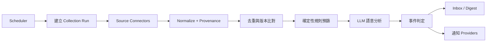
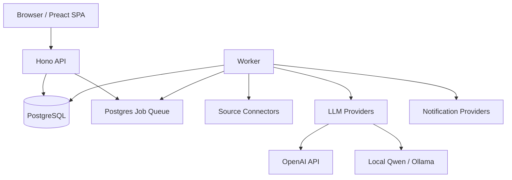

# Chitanda 平台設計定義

> 狀態：Draft v0.4（Phase 2 implemented）<br>
> 日期：2026-09-19<br>
> 目標讀者：產品維護者、開發者、來源 connector 開發者
> 技術基線：Node.js 24 LTS、TypeScript、Hono、Preact + Vite、PostgreSQL

## 1. 文件目的

Chitanda 是一套適合個人、家庭或少數朋友自架的 LLM-based 資訊收集與監測平台。使用者以自然語言描述「想知道什麼」，系統將需求轉換成可檢查、可修改、可排程的任務，持續從多種來源收集資訊，經規則與 LLM 分析後，只在符合條件時保存事件與通知使用者。

本文件定義第一版的產品範圍、核心模型、系統架構、可插拔介面、安全邊界及實作計畫。除非另有 ADR（Architecture Decision Record）覆寫，後續實作應以此文件為準。

## 2. 已確認的產品決策

| 項目                    | 決策                                                                             |
| ----------------------- | -------------------------------------------------------------------------------- |
| 使用規模                | 單一自架 instance，約 1–20 位受信任使用者                                        |
| 執行環境                | Node.js 24 LTS，TypeScript strict mode                                           |
| Web/API                 | Hono；同一 server 提供 API 與編譯後的靜態前端                                    |
| 前端                    | Preact + Vite SPA，不使用 Next.js、不需要 SSR                                    |
| 架構                    | 模組化單體；Web 與背景 Worker 為兩個 process                                     |
| 主要資料庫              | PostgreSQL                                                                       |
| 任務佇列                | PostgreSQL-backed job queue；MVP 不引入 Redis                                    |
| LLM                     | 至少支援 OpenAI GPT/Codex 與本機 Qwen                                            |
| 本機 LLM runtime        | 預設使用 Ollama 執行 Qwen；endpoint 與模型由 instance YAML 設定                  |
| 來源                    | Connector/adapter 可插拔                                                         |
| 部署                    | 初版使用 Docker Compose；架構與 container 從第一天保留 Kubernetes 部署能力       |
| 網路邊界                | 服務會暴露於公開網路；TLS 與反向代理由外部基礎設施負責，不屬於 Chitanda 部署範圍 |
| 設定管理                | 程式預設值 + 單一 YAML 設定檔；環境變數只保留部署差異與 secret 注入              |
| Dependency              | 新增時採當下 latest stable，提交 lockfile 固定可重現版本                         |
| 首個 reference template | 演唱會資訊                                                                       |
| 主要通知                | Email（SMTP）；站內 Inbox 同時保留                                               |
| 時區                    | instance 有預設時區，使用者可覆寫；排程以 IANA timezone 儲存                     |

「TypeScript 24 LTS」在本文件中解讀為 **Node.js 24 LTS + TypeScript**；TypeScript 本身不採 LTS 版號。

## 3. 目標與非目標

### 3.1 目標

1. 使用者能以自然語言建立資訊任務，並在啟用前看懂系統解析出的條件。
2. 可持續監測演唱會、商品價格、新產品、新聞、公開市場資訊等不同領域。
3. 來源、LLM 與通知管道皆可替換或擴充，不污染核心領域邏輯。
4. 使用規則先行、LLM 後置的處理方式，降低 token 成本與錯誤通知。
5. 每個判斷皆保留原始來源、擷取時間、判斷理由及模型資訊，讓使用者可追溯。
6. 一台一般主機即可自架、備份、升級與除錯。

### 3.2 非目標

- 不做大規模 SaaS、多租戶計費或企業級權限矩陣。
- 不保證即時交易等級的股價、庫存或拍賣資料。
- 不繞過登入、付費牆、CAPTCHA、robots 規則或網站存取限制。
- 不讓 LLM 自行執行任意程式、SQL、瀏覽器操作或任意外部請求。
- MVP 不做分散式微服務、Kafka、Elasticsearch 或 Kubernetes 必要依賴。
- 不將 LLM 的摘要視為事實來源；原始內容與可驗證連結才是證據。

## 4. 核心使用流程

### 4.1 建立任務

1. 使用者輸入自然語言，例如：

   > 每兩小時幫我找台北或新北、票價低於 3,000 元的日本樂團演唱會；有新場次就寄 Email 通知我，每天晚上再寄一份摘要。

2. Intent Parser 將文字解析為 `TaskDefinition` 草稿。
3. UI 顯示可讀摘要、結構化條件、預計使用的來源、頻率與通知方式。
4. 若關鍵資訊不完整，系統提出少量澄清問題；不得自行猜測高影響條件。
5. 使用者確認後才啟用排程。LLM 產出的設定永遠不能直接啟用。

### 4.2 持續收集與判斷



處理原則：先做便宜且可重現的檢查，再對剩餘候選內容呼叫 LLM。所有 stage 都必須可重試且具 idempotency。

### 4.3 閱讀與回饋

使用者可在 Inbox 檢視事件、摘要、符合條件的理由、原文片段與來源連結，並標記：

- 有用 / 沒用
- 誤判 / 重複
- 稍後閱讀 / 封存

初期回饋只用於調整規則與提供人工評估資料，不自動微調模型，也不在沒有確認時悄悄修改任務條件。

## 5. 功能需求

### 5.1 需求理解（Intent Understanding）

- 接受自然語言建立或修改任務。
- 解析主題、實體、包含/排除條件、門檻、時間範圍、地區、來源偏好、執行頻率及通知規則。
- LLM 必須以版本化 JSON Schema 輸出；通過 schema 與業務規則驗證後才能保存。
- 保存原始需求與解析結果，允許重新解析及比較差異。
- 對模糊的幣別、時區、價格含稅、資料新鮮度等提出澄清。
- UI 支援自然語言與表單雙向修改；表單是最終可執行定義。

### 5.2 多來源資訊收集（Information Acquisition）

MVP 支援下列 connector 類型：

1. RSS / Atom feed。
2. JSON REST API，可設定認證、query 與欄位 mapping。
3. Search API，由搜尋供應商 adapter 提供結果。
4. 靜態網頁：HTTP 抓取後以 CSS selector、JSON-LD 或 readability 解析。
5. 手動 URL / webhook ingest，方便測試及接收外部資料。

延後支援：需要 JavaScript 的瀏覽器擷取、電子郵件 inbox、社群平台專用 connector。瀏覽器擷取應作為可選 sidecar，不能成為基本部署的必要條件。

每筆內容至少保存：來源、原始 URL、canonical URL、來源 item ID、標題、本文或摘要、作者、發布時間、擷取時間、語言、媒體附件 metadata、內容 hash 與原始 payload 參照。

### 5.3 智慧分析與篩選（Intelligent Filtering）

分析順序固定如下：

1. 必填欄位與資料新鮮度檢查。
2. URL、來源 ID 與內容 hash 去重。
3. 關鍵字、數值、日期、地區、白名單及黑名單規則。
4. 可選的 embedding 相似度粗篩。
5. LLM 結構化分類、欄位擷取、相關度評分及摘要。
6. 事件規則判定。

LLM 結果至少包含 `matched`、`score`、`reason`、`facts`、`summary`、`uncertainties`。價格、漲跌幅、日期區間等可程式計算的值，必須由 deterministic code 驗證，不以 LLM 計算結果作為唯一依據。

### 5.4 持續監測與事件偵測（Continuous Monitoring）

- 支援 interval、cron 與手動執行。
- Connector 以 cursor/ETag/Last-Modified 等方式增量擷取。
- 監測 `new_item`、`content_changed`、`field_changed`、`threshold_crossed` 與 `back_in_stock` 等事件。
- 相同任務、相同內容、相同事件種類只能產生一個 active event。
- 失敗使用指數退避與 jitter；超過上限後進入 dead-letter 狀態並顯示於管理頁。
- 使用者可暫停任務、立即執行、查看最近 runs 與重新處理失敗項目。

### 5.5 個人化資訊服務（Personalized Information Delivery）

MVP 通知方式：

- 站內 Inbox
- Email（SMTP，第一優先外部通知）

後續 adapters：Generic webhook、Telegram Bot。

支援立即通知、固定時段 digest 與僅保存不推送。每個使用者可設定 quiet hours、時區、最低重要性及管道。通知必須有 idempotency key，避免 worker retry 造成重複發送。

對話式查詢可列入第二階段：查詢只使用已保存的內容與引用，不在回答時隱性啟動無限制的網路搜尋。

## 6. 可執行任務定義

`TaskDefinition` 是整個平台的核心契約，必須版本化。概念結構如下：

```ts
type TaskDefinitionV1 = {
  schemaVersion: 1;
  name: string;
  intent: string;
  locale: string;
  timezone: string;
  topics: string[];
  entities: Array<{ type: string; value: string; aliases?: string[] }>;
  sources: Array<{
    connectorId: string;
    configRef: string;
    query?: Record<string, unknown>;
  }>;
  filters: {
    all?: Condition[];
    any?: Condition[];
    none?: Condition[];
  };
  monitor: {
    schedule: { type: "interval" | "cron"; value: string };
    eventTypes: Array<
      "new_item" | "content_changed" | "field_changed" | "threshold_crossed" | "back_in_stock"
    >;
    lookback?: string;
  };
  analysis: {
    semanticMatch: boolean;
    minimumScore: number;
    extractionSchema?: Record<string, unknown>;
  };
  delivery: Array<{
    channel: "in_app" | "email" | "webhook" | "telegram";
    mode: "immediate" | "digest" | "store_only";
    minimumSeverity?: "low" | "normal" | "high";
  }>;
};
```

`Condition` 僅允許平台定義的欄位與 operator，例如 `equals`、`contains`、`in`、`lt`、`lte`、`gt`、`gte`、`between`、`before`、`after`、`regex`。不得由使用者或 LLM 注入 JavaScript、SQL 或 template expression。

## 7. 系統架構

### 7.1 邏輯元件



- **API process**：身份驗證、任務 CRUD、測試來源、查詢事件、管理設定、提供靜態 SPA。
- **Worker process**：排程、擷取、正規化、分析、事件判定與通知。
- **PostgreSQL**：業務資料、job queue、鎖、cursor 與 audit log。
- **Optional local model service**：Ollama 或其他提供 OpenAI-compatible endpoint 的 Qwen runtime。

API 與 Worker 使用同一份 domain packages，但 entrypoint 與生命週期分開；即使 API 重啟，排程工作仍可繼續執行。

### 7.2 建議 monorepo 結構

```text
chitanda/
├── apps/
│   ├── api/                 # Hono API、auth、靜態檔案服務
│   ├── web/                 # Preact + Vite SPA
│   └── worker/              # scheduler 與 pipeline workers
├── packages/
│   ├── core/                # domain entities、use cases、ports
│   ├── db/                  # schema、migration、repositories
│   ├── contracts/           # Zod/OpenAPI schema、shared DTO
│   ├── connectors/          # built-in source connectors
│   ├── llm/                 # provider adapters、prompts、evals
│   ├── notifications/       # delivery adapters
│   └── config/              # typed configuration
├── evals/                   # 固定輸入與預期判斷資料集
├── config/
│   └── default.yaml         # 非敏感、低變動的集中預設設定
├── docs/                    # ADR、操作與 connector 文件
├── deploy/
│   ├── compose.yaml         # 初版部署
│   └── helm/                # 後期 Kubernetes packaging
└── PLATFORM_DESIGN.md
```

### 7.3 技術選型

| 層                  | 建議                                                                |
| ------------------- | ------------------------------------------------------------------- |
| Runtime             | Node.js 24 LTS                                                      |
| Package manager     | pnpm workspace                                                      |
| API                 | Hono                                                                |
| Web                 | Preact、Vite、TanStack Query                                        |
| Schema/API contract | Zod + OpenAPI；由 contract 產生 typed client                        |
| Database            | PostgreSQL；Drizzle ORM + SQL migrations                            |
| Job queue           | Graphile Worker 或同類 PostgreSQL-backed queue，實作前以 spike 決定 |
| HTML parsing        | Cheerio + Readability 類正文抽取工具                                |
| Optional browser    | Playwright sidecar                                                  |
| Test                | Vitest、Testcontainers、Playwright E2E                              |
| Logging             | 結構化 JSON log，所有 run 帶 correlation ID                         |

正式採用 Graphile Worker 前需驗證 Node.js 24、排程、重試、唯一 job 與 graceful shutdown；若不符合，替代方案仍必須使用 PostgreSQL，避免為小型部署新增 Redis。

### 7.4 設定管理原則

Chitanda 不使用大量 `.env` 作為一般設定介面。設定優先順序由低至高為：

1. 程式內建的安全預設值。
2. 版本控制內的 `config/default.yaml`，存放非敏感且不常變動的產品設定。
3. 部署時掛載的一份 instance YAML，僅覆寫環境差異。
4. Secret file 或 secret reference，存放密碼、API key 與 encryption key。
5. 少量環境變數，只供 container bootstrap 使用。

允許的 bootstrap 環境變數原則上限於 `CHITANDA_CONFIG_FILE`、`CHITANDA_DATABASE_URL`、`CHITANDA_MASTER_KEY_FILE` 等無法合理寫入 image 的部署參數。環境變數名稱集中於 typed config package，不讓各功能任意讀取 `process.env`。

以下設定直接採程式預設值或寫入 `default.yaml`：HTTP timeout、重試次數、抓取內容大小、預設排程限制、pagination 大小、支援的 connector 清單等。只有 secret、不同環境必然不同的 endpoint，以及基礎設施連線資訊才從部署環境注入。

Kubernetes 對應方式為：同一份 YAML 由 ConfigMap 掛載；敏感值由 Secret 以檔案掛載或 secret manager CSI 提供。Docker Compose 也掛載相同格式，避免兩套設定模型。

### 7.5 Dependency 版本政策

- 第一次加入 dependency 時，安裝 npm registry 當下的 latest stable；不採 alpha、beta、rc、canary 或 nightly。
- 安裝後提交 `pnpm-lock.yaml`，CI 與 image build 使用 frozen lockfile，確保開發、Compose 與 Kubernetes build 可重現。
- `package.json` 保存合理的 semver range，但實際部署版本由 lockfile 決定。
- 更新 dependency 時同樣選最新 stable，通過 typecheck、unit、integration 與必要的 migration/eval 後才合併。
- Node.js base image 使用 Node 24 LTS 的明確 patch/digest；由維護流程定期更新，不使用會在未審核下漂移的 runtime image。

## 8. 可插拔介面

### 8.1 Source Connector

```ts
interface SourceConnector<TConfig, TCursor = unknown> {
  readonly manifest: {
    id: string;
    version: string;
    displayName: string;
    capabilities: Array<"poll" | "search" | "webhook" | "incremental">;
    configSchema: unknown;
  };

  validateConfig(config: TConfig): Promise<void>;
  collect(ctx: CollectContext<TConfig, TCursor>): AsyncIterable<SourceRecord>;
  healthCheck?(ctx: ConnectorContext<TConfig>): Promise<HealthStatus>;
}
```

規則：

- Connector 回傳統一的 `SourceRecord`，不能直接寫 event 或發通知。
- Secret 只透過 `secretRef` 在執行時取得，不放入 task JSON 或 log。
- 必須支援 timeout、AbortSignal、rate limit 與明確的錯誤分類。
- Cursor 只有在該批資料成功持久化後才能前進。
- MVP connector 由程式碼明確註冊；不接受 UI 上傳及執行任意第三方套件。
- 未來外部 plugin 應以獨立 process/container + versioned protocol 隔離，而不是在主 process 動態 `import` 不受信任程式碼。

### 8.2 LLM Provider

核心只依賴能力，不依賴廠牌：

```ts
interface LlmProvider {
  readonly id: string;
  generateObject<T>(request: {
    model: string;
    system: string;
    input: string;
    schema: unknown;
    timeoutMs: number;
    metadata?: Record<string, string>;
  }): Promise<LlmResult<T>>;
}
```

首批 adapters：

- `openai`：使用 Responses API，model ID 由管理者設定，可配置 GPT 或支援 Responses API 的 Codex model；不把特定 model 名稱寫死在 domain code。
- `ollama`：本機 Qwen 的預設 adapter，可設定 endpoint 與 model。
- `openai-compatible`：供其他本機或自架 model server 使用，可設定 base URL、model、API key（如需要）。

不同工作可分別選 model：`intent_parser`、`content_classifier`、`summarizer`、`embedding`。預設以本機 Qwen 做大量初篩，較高價模型只處理歧義或高價值候選；使用者可選擇全本機模式。

OpenAI adapter 應支援 `store: false` 的隱私設定、timeout、有限重試、token usage 與 request ID 記錄。官方文件指出 Responses API 支援結構化輸出與工具型工作，而目前模型可透過 Responses API 使用；實作時以當時可用的 model ID 與官方 SDK 為準：

- [OpenAI Models](https://developers.openai.com/api/docs/models)
- [OpenAI Responses API](https://developers.openai.com/api/reference/resources/responses/methods/create)

### 8.3 Notification Provider

```ts
interface NotificationProvider<TConfig> {
  readonly id: string;
  validateConfig(config: TConfig): Promise<void>;
  send(message: DeliveryMessage, context: DeliveryContext): Promise<DeliveryReceipt>;
}
```

Provider 必須接受 idempotency key，並回報 delivered、retryable failure 或 permanent failure。訊息 render 與 transport 分離，以避免每個 provider 各自產生不同內容。

## 9. 資料模型

主要資料表如下：

| Table                  | 用途                                         |
| ---------------------- | -------------------------------------------- |
| `users`                | 本機帳號、偏好、時區、狀態                   |
| `sessions`             | 安全 cookie session                          |
| `tasks`                | 任務 metadata、狀態、owner                   |
| `task_revisions`       | 原始自然語言、版本化 definition、解析資訊    |
| `source_configs`       | Connector 設定及 secret references           |
| `collection_runs`      | 每次執行狀態、統計、錯誤與時間               |
| `source_items`         | 正規化內容、provenance、canonical identity   |
| `source_item_versions` | 內容變更歷史與 hash                          |
| `task_candidates`      | item 與 task 的預篩/分析結果                 |
| `analysis_results`     | prompt version、provider、model、結果、usage |
| `events`               | 去重後的使用者事件                           |
| `deliveries`           | 通知排程、嘗試次數與 receipt                 |
| `connector_cursors`    | 每個 task/source 的增量擷取狀態              |
| `secrets`              | 加密後的 connector/provider credentials      |
| `audit_logs`           | 設定與狀態變更紀錄                           |
| `user_feedback`        | useful、irrelevant、duplicate 等回饋         |

重要唯一鍵：

- `source_items(connector_id, source_key, external_id)`；`source_key` 由 connector query 正規化後產生，無 external ID 時以 canonical URL/hash 策略補足。
- `source_item_versions(source_item_id, content_hash)`。
- `events(task_id, source_item_id, event_type, event_fingerprint)`。
- `deliveries(event_id, user_id, channel, schedule_bucket)`。

原始 payload 若小可存在 PostgreSQL JSONB；若體積變大，再抽象為 blob store，預設使用本機 volume，S3-compatible storage 為選配。

## 10. API 邊界

初版 REST API：

```text
POST   /api/auth/login
POST   /api/auth/logout
GET    /api/tasks
POST   /api/tasks/interpret
POST   /api/tasks
GET    /api/tasks/:id
PATCH  /api/tasks/:id
POST   /api/tasks/:id/activate
POST   /api/tasks/:id/pause
POST   /api/tasks/:id/run
GET    /api/tasks/:id/runs
GET    /api/events
GET    /api/events/:id
POST   /api/events/:id/feedback
GET    /api/connectors
POST   /api/connectors/:id/test
GET    /api/providers
POST   /api/providers/:id/test
GET    /api/admin/health
GET    /api/admin/jobs
```

所有 request/response 由 shared schema 定義。錯誤回應使用統一 error code，不將 stack trace、secret 或完整第三方 response 回傳瀏覽器。

## 11. 去重、變更與事件語意

去重不可只依賴 embedding。依序使用：

1. Connector + external ID。
2. 正規化 canonical URL。
3. 移除動態區塊後的內容 hash。
4. 標題、時間、來源等組合 fingerprint。
5. 必要時才以語意相似度標記「可能重複」，並保留人工覆寫。

內容變更時建立新 version，不覆寫舊內容。`threshold_crossed` 必須比較前一個已確認數值與目前數值；若內容解析不確定，事件標記為 `needs_review` 而不是直接通知。

## 12. 安全、隱私與合規

- 威脅模型以服務暴露於公開網路為基準；不得因使用人數少而省略認證、輸入驗證、rate limit 或審計。
- TLS termination、憑證、公開 DNS 與反向代理由外部基礎設施負責，不由 Chitanda 建立或管理。
- 首位管理者由一次性 bootstrap token 建立；其他帳號只能由管理者邀請。
- 密碼使用 Argon2id；session 使用 HttpOnly、Secure、SameSite cookie，並定期 rotation；管理者帳號強制啟用 TOTP MFA。
- 寫入操作防 CSRF；登入、密碼重設、intent parsing 與測試 connector/provider 端點限制頻率。
- 預設只允許 same-origin browser request；允許的 Host/Origin 必須明確設定，不使用 wildcard CORS。
- 只有明確列入 trusted proxies 的來源才能提供 `Forwarded`/`X-Forwarded-*` 資訊；來自其他來源的轉送 headers 一律忽略。安全性 rate limit 不只依賴可偽造的 client IP。
- 只有 API port 對外提供服務；Worker、PostgreSQL、Ollama 及管理/metrics endpoints 不得直接暴露於公開網路。
- 登入、登出、MFA、帳號鎖定、權限與 secret 變更寫入 audit log；登入錯誤訊息不得洩漏帳號是否存在。
- API key 僅存在 server；以 instance master key 加密 at rest，log 一律遮罩。
- 對自訂 URL 阻擋 loopback、link-local、私有網段與 cloud metadata endpoint，防止 SSRF；必要的內網來源由管理者明確 allowlist。
- HTTP client 限制 redirect 次數、回應大小、content type 與 timeout。
- 網頁內容視為不受信任資料。Prompt 明確分隔內容，LLM 分析階段不提供工具，也不能依內容指示修改任務或洩漏 secret。
- HTML 顯示前 sanitization；外部圖片預設不自動載入或由 image proxy 控制。
- Connector 必須遵守來源條款、robots、rate limit 與授權；優先使用正式 API/RSS。
- 使用者可刪除 task、事件與相關內容；備份保留政策由管理者設定。
- Cloud LLM 的資料傳輸必須在 UI 清楚標示；全本機模式不得 fallback 到 cloud。

## 13. 可觀測性與操作性

管理頁至少提供：

- API、Worker、PostgreSQL、LLM provider 與 connector health。
- 近期 runs 的耗時、取得筆數、去重數、LLM 呼叫數、事件數與錯誤。
- 佇列深度、retry 與 dead-letter jobs。
- 每任務 token usage；若 provider 提供成本資訊，可顯示估算值但標為 estimate。
- Prompt version、model、provider、輸入內容 hash 與 structured output，方便重現判斷。

Log 使用 JSON，包含 `requestId`、`runId`、`taskId`、`jobId`；不得記錄 secret 或未遮罩的個資。MVP 不強制外部 telemetry 平台，但應提供 Prometheus metrics endpoint 作為選配。

## 14. 部署、Kubernetes 預留與備份

### 14.1 初版 Docker Compose

最小 Docker Compose 拓撲：

```text
external TLS / reverse proxy (out of scope)
  └── chitanda-api

chitanda private network
  ├── chitanda-api ─── PostgreSQL
  └── chitanda-worker
        ├── PostgreSQL
        ├── Internet sources
        ├── OpenAI (optional)
        └── Ollama/Qwen (default local runtime)
```

Chitanda Compose 定義 `api`、`worker`、`postgres` 與選用的 `ollama`；API container 可直接提供 Vite build 產物。TLS 與反向代理不包含在 Compose 內，由部署者既有的外部網路邊界處理。

### 14.2 Kubernetes-ready 約束

初版不必先維護完整 Kubernetes manifests，但程式與 image 必須符合下列約束，避免日後重構：

- API 與 Worker 使用相同 immutable image、不同 command；container filesystem 視為唯讀且不可保存業務狀態。
- API 無本機 session 狀態，任何 replica 都可處理請求；session、job、cursor 與 lock 均在 PostgreSQL。
- Worker 可水平擴充；job claim、retry、排程與 notification idempotency 依靠資料庫協調，不依賴單一 process 記憶體。
- Scheduler 必須以資料庫 lock 或唯一 job 防止多 replica 重複排程，不假設只有一個 Worker。
- 提供獨立的 startup、readiness 與 liveness endpoints；readiness 檢查依賴是否可服務，liveness 不因暫時的外部來源失敗而重啟。
- 正確處理 `SIGTERM`：停止接受新工作、延長或釋放 job lease、等待有限時間後退出。
- DB migration 是獨立 command/job，不由每個 API/Worker replica 在啟動時競爭執行。
- Log 寫 stdout/stderr；metrics 使用獨立 endpoint；不依賴 host path。
- 原始大檔若離開 PostgreSQL，使用 S3-compatible object storage abstraction；不能把單機 volume path 暴露給 domain code。
- Qwen/Ollama 是獨立 provider endpoint；主應用不假設模型與自己位於同一台機器或同一 Pod。
- 不在應用或 Chitanda deployment manifests 內終止或管理 TLS；外部網路邊界如何實作不屬於本平台範圍。
- 所有 resource request/limit、PodDisruptionBudget、autoscaling 與 NetworkPolicy 留在部署層，不進入業務設定。

後期 Kubernetes packaging 建議使用 Helm chart，最少包含 API Deployment、Worker Deployment、migration Job、Service、ConfigMap、Secret references 與 ServiceAccount。PostgreSQL 預設視為外部相依；若提供內建 chart，只供開發或小型自架，不與應用生命週期綁定。

### 14.3 備份與升級

備份至少涵蓋 PostgreSQL dump、master key、上傳/blob volume 與版本化設定。文件需提供還原演練流程；沒有 master key 的資料庫備份無法還原 secrets，因此兩者必須分開、安全地備份。

升級流程：備份 → 執行 DB migration → 啟動新 API/Worker → health check → 必要時依 migration 文件回復。Schema migration 不應依賴服務啟動時的隱性副作用。

## 15. 測試策略

- **Unit**：filter operators、時間/幣別、去重、事件狀態機、通知 idempotency。
- **Contract**：每個 connector 對固定 fixture 產生合法 `SourceRecord`；每個 LLM provider 通過相同 contract tests。
- **Integration**：使用真實 PostgreSQL 測試 queue、locking、migration 與 repositories。
- **Golden/Eval**：對 intent parsing、分類與 extraction 維護匿名化固定資料集；prompt/model 更新前比較 precision、recall 與 schema failure rate。
- **E2E**：建立任務 → 測試來源 → 啟用 → 收到 fixture → 事件出現在 Inbox → 發送測試通知。
- **Failure tests**：429、timeout、無效 JSON、來源格式改變、Worker crash、重複 job、LLM unavailable。

任何模型更新不得只以「感覺更好」上線；至少需通過既有 eval，並記錄 prompt/model version。

## 16. 分階段實作計畫

### Phase 0 — 專案骨架與基礎設施

- 建立 pnpm monorepo、TypeScript strict、lint/format/test。
- 建立 Hono API、Preact/Vite UI、Worker entrypoint。
- PostgreSQL migration、單一 YAML typed config、Kubernetes-compatible health checks、Docker Compose。
- Image 採非 root、唯讀 filesystem 可運作、可分別啟動 API/Worker/migration command，並實作 graceful shutdown。
- 建立公開網路所需的安全基線：本機帳號、session、CSRF、rate limit、Host/Origin allowlist、管理者 TOTP MFA 與 audit log。
- 建立 domain ports 與 adapter 邊界，不先實作特定業務案例。

完成條件：單一命令可啟動 API、Web、Worker、DB；CI 可執行 typecheck 與 tests；兩個 app containers 不依賴本機持久狀態，且可通過 termination/health probe 測試。

### Phase 1 — 任務建立與 LLM abstraction

- `TaskDefinitionV1` schema、revision 與 activation workflow。
- OpenAI Responses adapter、本機 Qwen adapter。
- 自然語言解析、澄清問題、preview/confirm UI。
- Provider 測試頁與 prompt/version 記錄。

完成條件：同一需求可分別由 OpenAI 與 Qwen 解析，產生可驗證、可手動修改的草稿；未確認草稿不會執行。

### Phase 2 — 收集 pipeline 與第一批 connectors

- Job scheduler、run lifecycle、retry/idempotency。
- RSS、generic JSON API、manual/webhook connectors。
- Normalize、provenance、cursor、hash 去重與 item version。
- Runs 管理 UI。

完成條件：可穩定增量收集 fixture RSS/API，重跑不重複建立 item。

### Phase 3 — 分析、事件與 Inbox

- Deterministic filter engine。
- LLM classify/extract/summarize pipeline。
- 事件 state machine、變更與 threshold crossing。
- Inbox、事件詳情、證據與 feedback。

完成條件：從來源內容到事件的整條流程可重現，並清楚顯示符合或不符合的原因。

### Phase 4 — 通知與實際來源

- Email（SMTP）provider 與寄送設定測試。
- Immediate/digest、quiet hours、delivery retry。
- Search API 與靜態網頁 connector。
- 以演唱會資訊作為第一個 end-to-end reference template。

完成條件：同一事件不因 retry 重複通知；reference template 可由新使用者在 UI 建立並成功執行。

### Phase 5 — 自架強化與 plugin 開發體驗

- 強化 secret rotation、SSRF controls 與安全稽核工具。
- Generic webhook、Telegram 等額外通知 providers。
- 備份/還原、升級與故障排除文件。
- Connector SDK、contract test kit 與範例 connector。
- 使用實際運行資料調整 retention、模型路由與成本控制。

完成條件：全新主機可依文件部署、備份並還原；第三方開發者不修改 core 即可新增受信任 connector。

## 17. MVP 驗收標準

MVP 定義為 Phase 0–4，需同時符合：

1. 使用者能以中文自然語言建立任務、檢查解析結果並確認啟用。
2. OpenAI GPT/Codex provider 與本機 Qwen provider 均可選用；本機模式不需 OpenAI key。
3. 至少有 RSS、JSON API、webhook 與一種 search/web connector。
4. Worker 重啟或相同 job 重跑不會重複建立 item、event 或 delivery。
5. 事件頁能回到原始來源，並顯示擷取時間、條件、判斷理由、provider/model。
6. 支援站內 Inbox 與 Email 通知，並通過 delivery retry 與重複寄送測試。
7. Docker Compose 可在單機完成安裝，備份/還原經實際測試。
8. 重要規則與 pipeline 有自動化測試；LLM 任務有最小 eval dataset。

## 18. 風險與對策

| 風險                      | 對策                                                                        |
| ------------------------- | --------------------------------------------------------------------------- |
| 網站結構改版造成擷取失敗  | 優先 API/RSS；connector health、fixture contract test、錯誤告警             |
| LLM 誤判或 hallucination  | structured output、規則驗證、保留證據、不確定時降級為人工檢查               |
| 成本快速上升              | 規則預篩、內容 hash cache、每任務 budget、模型分工、全本機選項              |
| 重複通知                  | DB 唯一鍵、event fingerprint、delivery idempotency key                      |
| 本機 Qwen 能力不足        | UI 顯示模型與信心；允許按工作類型 fallback，但全本機模式禁止 cloud fallback |
| 網頁內容 prompt injection | 內容視為資料、無工具分析、schema allowlist、禁止模型直接觸發副作用          |
| 自架設定過於複雜          | 三個必要 containers、setup wizard、合理預設、health page                    |
| 股價/價格資訊不準或過期   | 顯示來源與時間；使用授權 API；門檻以程式驗證；不宣稱交易即時性              |

## 19. 實作前需以 ADR 定案的項目

下列問題不阻擋 Phase 0，但應在相關 phase 開始前建立 ADR：

1. PostgreSQL job queue 最終選型及其 Node.js 24 相容性。
2. 預設 Qwen 模型大小與本機硬體最低需求。
3. Embedding 是否進入 MVP；若加入，採 pgvector 或純應用層索引。
4. 原始 payload 的預設 retention 天數及每 instance 儲存上限。
5. 外部 connector plugin 採 container protocol 或獨立 process protocol。
6. Kubernetes Helm chart 的交付時點，以及正式環境 PostgreSQL/object storage 的支援範圍。

第一個 reference template 已確定為「演唱會資訊」，用來驗證地區、日期、票價、藝人別名、重複場次與新增事件。
